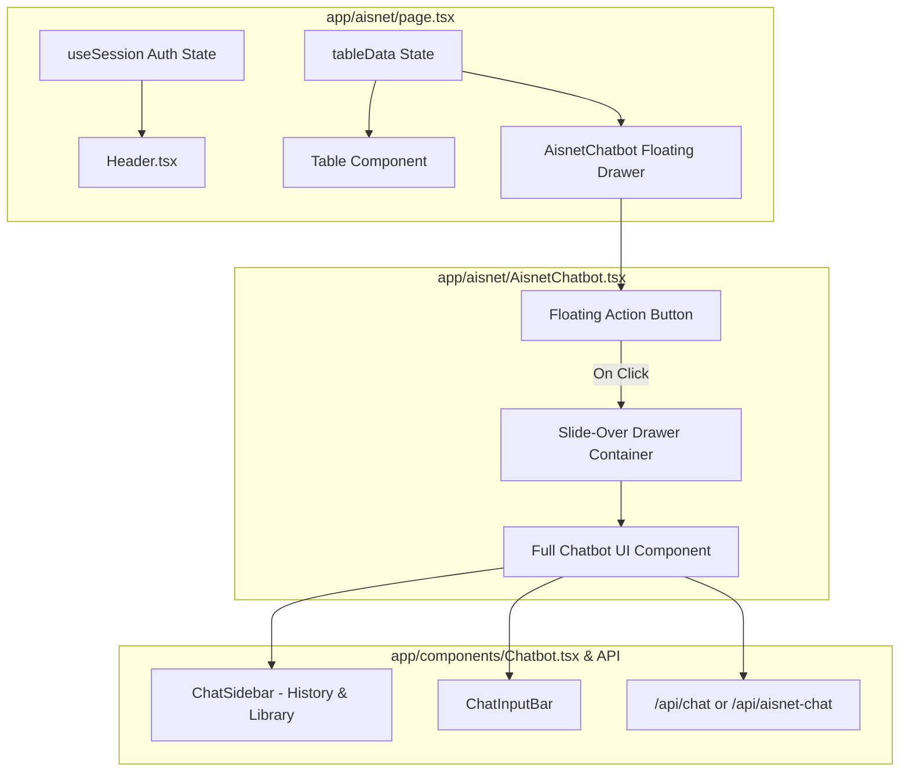

# Design Specification: AISnet User Session Header, Dynamic `tableData`, & Full Chatbot Integration

**Date**: 2026-08-13  
**Status**: Approved by User  
**Target System**: AISnet Portal & Chatbot Module (`app/aisnet/*`, `app/components/*`, `app/api/*`)

---

## 1. Overview & Objectives

This design addresses three core enhancements requested for the AISnet lecturer portal:
1. **User Session in Header**: Dynamically display the logged-in lecturer's profile (name, role, avatar) in `app/aisnet/components/Header.tsx` using `useSession()`.
2. **Dynamic `tableData` State**: Replace hardcoded `TABLE_DATA` in `app/aisnet/page.tsx` with a flexible state variable `tableData`.
3. **Reusing Full Chatbot in AISnet**: Embed the full-featured `Chatbot` UI (from `app/components/Chatbot.tsx` with history, document library, and streaming) inside a floating slide-over drawer on the AISnet page, preloaded with comprehensive RAG context calculated/summarized from `tableData`.

---

## 2. Component Architecture & Data Flow



---

## 3. Detailed Component Specs

### 3.1. AISnet Header (`app/aisnet/components/Header.tsx`)
- **Hook Integration**: Import `useSession()` from `@/lib/auth-client`.
- **Data Rendering**:
  - `user.name`: Display capitalized full name (e.g. `user?.name || "Leni Fitriani"`).
  - `user.role`: Display user role (e.g. `user?.role || "Dosen"`).
  - `user.image`: If present, set avatar `src`. Fallback to initials generated from `user.name` if `image` is null/empty.
- **Loading State**: Render skeletal fallback or muted default values while `isLoading` is true to prevent layout shift.

### 3.2. Dynamic Table Data (`app/aisnet/page.tsx`)
- **State Definition**:
  ```tsx
  const INITIAL_TABLE_DATA: TableRow[] = [ /* initial rows */ ];
  const [tableData, setTableData] = useState<TableRow[]>(INITIAL_TABLE_DATA);
  ```
- **Table Rendering**: Replace references to `TABLE_DATA` with `tableData.map((row) => ...)` throughout the page.
- **Prop Forwarding**: Pass `tableData` directly to `<AisnetChatbot tableData={tableData} />`.

### 3.3. Reusable AISnet Chatbot Floating Drawer (`app/aisnet/AisnetChatbot.tsx`)
- **Presentation**:
  - **Collapsed**: A sleek floating action button at `fixed bottom-6 right-6 z-[200]`.
  - **Expanded**: A slide-over drawer / large popover modal (e.g. `w-[520px] md:w-[720px] h-[85vh]`) overlaying the right side of the screen.
- **Content**:
  - Contains the full `Chatbot` interface (or a specialized `Chatbot` configuration supporting AISnet context).
  - Renders sidebar history toggles, document library, and chat area seamlessly within the drawer container.
- **RAG & `tableData` Context**:
  - Formats `tableData` into a rich, structured dataset summary (total funding, per-scheme breakdowns, research titles, researchers, outputs, and statuses).
  - Supplies this summary to the AI request as context so the LLM has complete background knowledge without needing manual `pageContext` prompt hacking.

---

## 4. Verification Plan

1. **Header Verification**:
   - Log in as a user and navigate to `/aisnet`.
   - Confirm that `Header.tsx` displays the correct user name, role, and avatar.
2. **Table Data Verification**:
   - Check that `/aisnet` renders rows properly using `tableData`.
3. **Chatbot Drawer Verification**:
   - Click floating button at bottom-right of `/aisnet`.
   - Verify drawer opens smoothly with full Chatbot UI.
   - Send questions about research funding/table data (e.g., "Berapa total pencairan dana penelitian?").
   - Confirm streaming response correctly leverages the `tableData` context.
