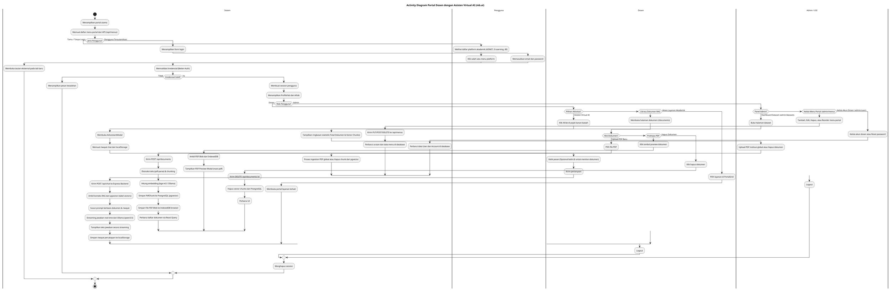

# Activity Diagram

```plantuml
@startuml
title Activity Diagram Portal Dosen dengan Asisten Virtual AI (mb.ai)

scale 0.80
skinparam shadowing false
skinparam defaultFontSize 11
skinparam activityFontSize 11

|Sistem|
start
:Menampilkan portal utama;
:Memuat daftar menu portal dari API (/api/menus);

if (Jenis Pengguna?) then (Tamu / Tanpa Login)

    |Pengguna|
    :Melihat daftar platform akademik (AISNET, E-Learning, dll);
    :Klik salah satu menu platform;

    |Sistem|
    :Membuka tautan eksternal pada tab baru;

else (Pengguna Terautentikasi)

    |Sistem|
    :Menampilkan form login;

    |Pengguna|
    :Memasukkan email dan password;

    |Sistem|
    :Memvalidasi kredensial (Better-Auth);

    if (Kredensial Valid?) then (Tidak)

        :Menampilkan pesan kesalahan;

    else (Ya)

        :Membuat session pengguna;
        :Menampilkan ProfileFab dan AiFab;

        if (Role Pengguna?) then (Dosen)

            |Dosen|
            if (Pilihan Aktivitas?) then (Asisten Virtual AI)

                :Klik AiFab di pojok kanan bawah;

                |Sistem|
                :Membuka AiAssistantModal;
                :Memuat riwayat chat dari localStorage;

                |Dosen|
                :Ketik pesan (Opsional ketik @ untuk mention dokumen);
                :Kirim pertanyaan;

                |Sistem|
                :Kirim POST /api/chat ke Express Backend;
                :Ambil konteks RAG dari pgvector (tabel vectors);
                :Susun prompt berbasis dokumen & riwayat;
                :Streaming jawaban real-time dari Ollama (qwen3.5);
                :Tampilkan teks jawaban secara streaming;
                :Simpan riwayat percakapan ke localStorage;

            elseif (Library Dokumen RAG)

                |Dosen|
                :Membuka halaman dokumen (/documents);

                if (Aksi Dokumen?) then (Upload PDF Baru)

                    :Pilih file PDF;

                    |Sistem|
                    :Kirim POST /api/documents;
                    :Ekstraksi teks (pdf-parse) & chunking;
                    :Hitung embedding (bge-m3 / Ollama);
                    :Simpan PdfChunk ke PostgreSQL (pgvector);
                    :Simpan File PDF Blob ke IndexedDB browser;
                    :Perbarui daftar dokumen via React Query;

                elseif (Pratinjau PDF)

                    |Dosen|
                    :Klik tombol preview dokumen;

                    |Sistem|
                    :Ambil PDF Blob dari IndexedDB;
                    :Tampilkan PDF Preview Modal (react-pdf);

                else (Hapus Dokumen)

                    |Dosen|
                    :Klik hapus dokumen;

                    |Sistem|
                    :Kirim DELETE /api/documents/:id;
                    :Hapus vector chunks dari PostgreSQL;
                    :Perbarui UI;

                endif

            else (Akses Layanan Akademik)

                |Dosen|
                :Pilih layanan di PortalGrid;

                |Sistem|
                :Membuka portal layanan terkait;

            endif

            |Dosen|
            :Logout;

        else (Admin)

            |Admin / USI|
            if (Panel Admin?) then (Dashboard Dataset /admin/datasets)

                :Buka halaman dataset;

                |Sistem|
                :Tampilkan ringkasan statistik (Total Dokumen & Vector Chunks);

                |Admin / USI|
                :Upload PDF institusi global atau Hapus dokumen;

                |Sistem|
                :Proses ingestion PDF global atau Hapus chunk dari pgvector;

            elseif (Kelola Menu Portal /admin/menus)

                |Admin / USI|
                :Tambah, Edit, Hapus, atau Reorder menu portal;

                |Sistem|
                :Kirim PUT/POST/DELETE ke /api/menus;
                :Perbarui urutan dan data menu di database;

            else (Kelola Akun Dosen /admin/users)

                |Admin / USI|
                :Kelola akun dosen atau Reset password;

                |Sistem|
                :Perbarui data User dan Account di database;

            endif

            |Admin / USI|
            :Logout;

        endif

        |Sistem|
        :Menghapus session;

    endif

endif

stop
@enduml
```
