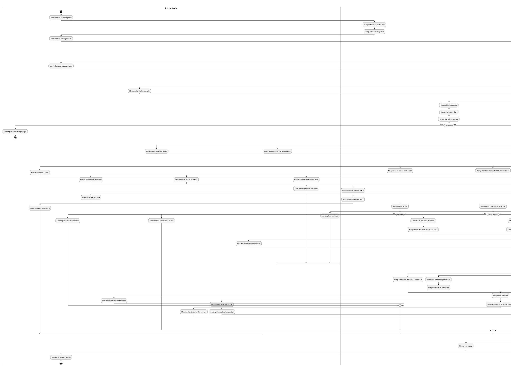

# Activity Diagram

```plantuml
@startuml
title Activity Diagram Portal Dosen dengan Chatbot Personal

|Portal Web|
start

:Menampilkan halaman portal;

|Backend dan Database|
:Mengambil menu portal aktif;
:Mengurutkan menu portal;

|Portal Web|
:Menampilkan daftar platform;

|Dosen|
:Melihat daftar platform;

if (Membuka platform?) then (Ya)

    :Memilih platform;

    |Portal Web|
    :Membuka tautan pada tab baru;

    |Dosen|
    :Mengakses platform eksternal;

else (Tidak)

endif

if (Menggunakan fitur personal?) then (Tidak)

    |Dosen|
    :Menggunakan portal tanpa login;

    stop

else (Ya)

    |Portal Web|
    :Menampilkan halaman login;

    |Dosen|
    :Memasukkan email dan password;

    |Backend dan Database|
    :Memvalidasi kredensial;
    :Memeriksa status akun;
    :Memeriksa role pengguna;

    if (Login valid?) then (Tidak)

        |Portal Web|
        :Menampilkan pesan login gagal;

        stop

    else (Ya)

        |Backend dan Database|
        :Membuat session pengguna;
        :Mencatat aktivitas login;

        if (Role pengguna?) then (Dosen)

            |Portal Web|
            :Menampilkan halaman dosen;

            |Dosen|
            :Memilih fitur dosen;

            if (Fitur dosen?) then (Profil)

                |Portal Web|
                :Menampilkan data profil;

                |Dosen|
                :Mengubah data profil;

                |Backend dan Database|
                :Memvalidasi kepemilikan akun;
                :Menyimpan perubahan profil;

                |Portal Web|
                :Menampilkan profil terbaru;

            elseif (Dokumen)

                |Backend dan Database|
                :Mengambil dokumen milik dosen;

                |Portal Web|
                :Menampilkan daftar dokumen;

                |Dosen|
                :Memilih PDF baru atau versi terbaru;

                |Portal Web|
                :Memvalidasi ekstensi file;

                |Backend dan Database|
                :Memvalidasi file PDF;

                if (PDF valid?) then (Tidak)

                    |Portal Web|
                    :Menampilkan pesan kesalahan;

                else (Ya)

                    |Backend dan Database|
                    :Menyimpan metadata dokumen;
                    :Mengubah status menjadi PROCESSING;

                    |RAG dan LLM|
                    :Mengekstrak teks PDF;
                    :Membagi teks menjadi chunk;
                    :Membuat embedding dengan BGE-M3;
                    :Menyimpan embedding ke pgvector;

                    if (Pemrosesan berhasil?) then (Ya)

                        |Backend dan Database|
                        :Mengubah status menjadi COMPLETED;

                    else (Tidak)

                        |Backend dan Database|
                        :Mengubah status menjadi FAILED;
                        :Menyimpan pesan kesalahan;

                    endif

                    |Portal Web|
                    :Menampilkan status pemrosesan;

                endif

            elseif (Chatbot)

                |Backend dan Database|
                :Mengambil dokumen COMPLETED milik dosen;

                |Portal Web|
                :Menampilkan pilihan dokumen;

                |Dosen|
                :Memilih dokumen sumber;
                :Menulis pertanyaan;

                |Backend dan Database|
                :Memvalidasi kepemilikan dokumen;

                if (Dokumen valid?) then (Tidak)

                    |Portal Web|
                    :Menampilkan pesan akses ditolak;

                else (Ya)

                    |Backend dan Database|
                    :Menyimpan pertanyaan;
                    :Memuat riwayat percakapan;

                    |RAG dan LLM|
                    :Mengidentifikasi jenis pertanyaan;
                    :Membuat embedding pertanyaan;

                    if (Jenis pertanyaan?) then (Personal)

                        :Mencari informasi pada dokumen terpilih;

                    else (Institusi)

                        :Mencari informasi pada dataset institusi;

                    endif

                    if (Konteks ditemukan?) then (Ya)

                        :Menyusun prompt berdasarkan konteks;
                        :Menghasilkan jawaban dengan Qwen;

                        |Backend dan Database|
                        :Menyimpan jawaban;
                        :Menyimpan nama dokumen sumber;

                        |Portal Web|
                        :Menampilkan jawaban dan sumber;

                    else (Tidak)

                        |RAG dan LLM|
                        :Menghasilkan jawaban umum dengan Qwen;

                        |Backend dan Database|
                        :Menyimpan jawaban umum;
                        :Menandai jawaban sebagai general answer;

                        |Portal Web|
                        :Menampilkan jawaban umum;
                        :Menampilkan peringatan sumber;

                    endif

                    |Dosen|
                    :Menyalin, mengirim ulang,\natau menghapus pesan;

                endif

            else (Riwayat)

                |Backend dan Database|
                :Mengambil riwayat percakapan;

                |Portal Web|
                :Menampilkan daftar percakapan;

                |Dosen|
                :Melanjutkan percakapan;
                :Mengubah judul atau menghapus percakapan;

                |Backend dan Database|
                :Menyimpan perubahan riwayat;

            endif

            |Dosen|
            :Memilih logout;

            |Backend dan Database|
            :Mengakhiri session;

        else (Admin)

            |Portal Web|
            :Menampilkan portal dan panel admin;

            |Admin atau USI|
            :Memilih fitur admin;

            if (Fitur admin?) then (Akun Dosen)

                :Menambah akun dosen;
                :Mengaktifkan atau menonaktifkan akun;
                :Mereset password atau menghapus akun;

                |Backend dan Database|
                :Memvalidasi data akun;
                :Menyimpan perubahan akun;
                :Mencatat audit log;

            elseif (Menu Portal)

                |Admin atau USI|
                :Menambah atau mengubah menu;
                :Mengatur urutan menu;
                :Mengaktifkan atau menghapus menu;

                |Backend dan Database|
                :Menyimpan perubahan menu;
                :Mencatat audit log;

            elseif (Dataset Institusi)

                |Admin atau USI|
                :Menambah atau memperbarui dataset;

                |Backend dan Database|
                :Menyimpan dataset;
                :Mengubah status menjadi PROCESSING;

                |RAG dan LLM|
                :Mengekstrak teks dataset;
                :Membuat embedding dengan BGE-M3;
                :Menyimpan embedding ke pgvector;

                if (Pemrosesan berhasil?) then (Ya)

                    |Backend dan Database|
                    :Mengubah status menjadi COMPLETED;

                else (Tidak)

                    |Backend dan Database|
                    :Mengubah status menjadi FAILED;
                    :Menyimpan pesan kesalahan;

                endif

                :Mencatat audit log;

            elseif (Metadata Dokumen)

                |Backend dan Database|
                :Mengambil metadata dokumen dosen;

                |Portal Web|
                :Menampilkan metadata dokumen;
                :Tidak menampilkan isi dokumen;

            else (Audit Log)

                |Backend dan Database|
                :Mengambil log aktivitas;

                |Portal Web|
                :Menampilkan audit log;

            endif

            |Admin atau USI|
            :Memilih logout;

            |Backend dan Database|
            :Mengakhiri session;

        endif

    endif

endif

|Portal Web|
:Kembali ke halaman portal;

stop
@enduml
```
