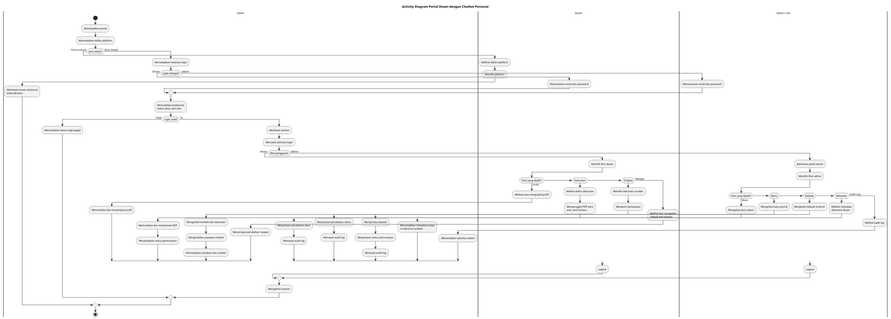

# Activity Diagram

```plantuml
@startuml
title Activity Diagram Portal Dosen dengan Chatbot Personal

scale 0.80
skinparam shadowing false
skinparam defaultFontSize 11
skinparam activityFontSize 11

|Sistem|
start
:Menampilkan portal;
:Menampilkan daftar platform;

if (Jenis akses?) then (Portal umum)

    |Dosen|
    :Melihat daftar platform;
    :Memilih platform;

    |Sistem|
    :Membuka tautan eksternal\npada tab baru;

else (Fitur sistem)

    |Sistem|
    :Menampilkan halaman login;

    if (Login sebagai?) then (Dosen)

        |Dosen|
        :Memasukkan email dan password;

    else (Admin)

        |Admin / USI|
        :Memasukkan email dan password;

    endif

    |Sistem|
    :Memvalidasi kredensial,\nstatus akun, dan role;

    if (Login valid?) then (Tidak)

        :Menampilkan pesan login gagal;

    else (Ya)

        :Membuat session;
        :Mencatat aktivitas login;

        if (Role pengguna?) then (Dosen)

            |Dosen|
            :Memilih fitur dosen;

            if (Fitur yang dipilih?) then (Profil)

                :Melihat atau mengubah profil;

                |Sistem|
                :Memvalidasi dan menyimpan profil;

            elseif (Dokumen)

                |Dosen|
                :Melihat daftar dokumen;
                :Mengunggah PDF baru\natau versi terbaru;

                |Sistem|
                :Memvalidasi dan memproses PDF;
                :Menampilkan status pemrosesan;

            elseif (Chatbot)

                |Dosen|
                :Memilih dokumen sumber;
                :Mengirim pertanyaan;

                |Sistem|
                :Mengambil konteks dari dokumen;
                :Menghasilkan jawaban chatbot;
                :Menampilkan jawaban dan sumber;

            else (Riwayat)

                |Dosen|
                :Melihat dan mengelola\nriwayat percakapan;

                |Sistem|
                :Menyimpan perubahan riwayat;

            endif

            |Dosen|
            :Logout;

        else (Admin)

            |Admin / USI|
            :Membuka panel admin;
            :Memilih fitur admin;

            if (Fitur yang dipilih?) then (Akun)

                :Mengelola akun dosen;

                |Sistem|
                :Menyimpan perubahan akun;
                :Mencatat audit log;

            elseif (Menu)

                |Admin / USI|
                :Mengelola menu portal;

                |Sistem|
                :Menyimpan perubahan menu;
                :Mencatat audit log;

            elseif (Dataset)

                |Admin / USI|
                :Mengelola dataset institusi;

                |Sistem|
                :Memproses dataset;
                :Menyimpan status pemrosesan;
                :Mencatat audit log;

            elseif (Metadata)

                |Admin / USI|
                :Melihat metadata\ndokumen dosen;

                |Sistem|
                :Menampilkan metadata tanpa\nisi dokumen pribadi;

            else (Audit Log)

                |Admin / USI|
                :Melihat audit log;

                |Sistem|
                :Menampilkan aktivitas sistem;

            endif

            |Admin / USI|
            :Logout;

        endif

        |Sistem|
        :Mengakhiri session;

    endif

endif

stop
@enduml
```
