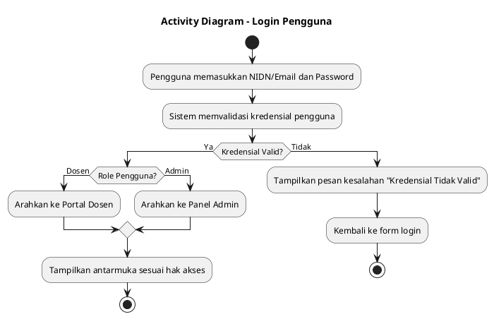
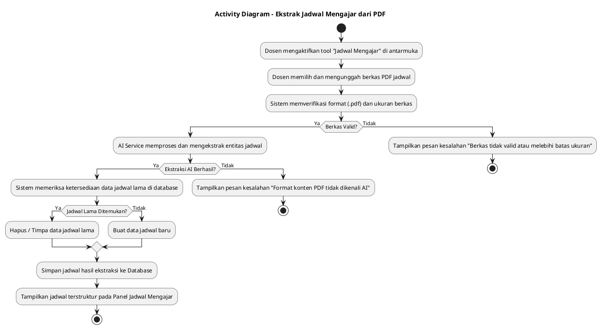
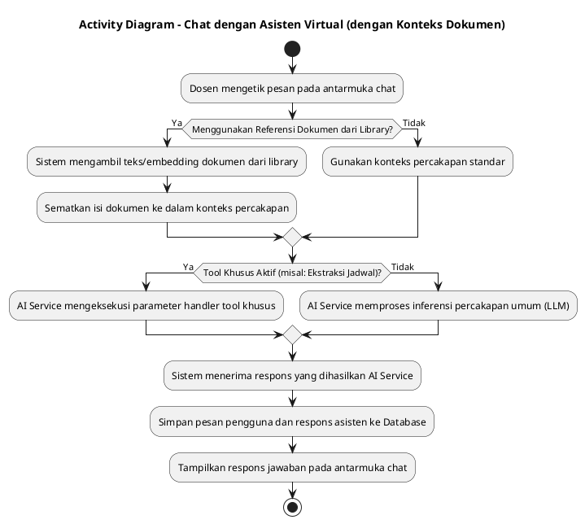

# Activity Diagram — Portal Dosen & Asisten Virtual (ITG)

Dokumen ini memuat tepat 3 Activity Diagram untuk proses-proses inti yang memiliki percabangan logika bisnis nyata (validasi, penanganan kegagalan, dan multi-jalur keputusan).

---

## 1. Activity Diagram: Login

### Penjelasan Diagram

Memodelkan validasi kredensial pengguna dan percabangan _routing_ ke antarmuka Dashboard Dosen atau Dashboard Admin berdasarkan _role_ yang terverifikasi.

---

## 2. Activity Diagram: Ekstrak Jadwal Mengajar dari PDF

### Penjelasan Diagram

Memodelkan alur validasi berkas PDF, proses ekstraksi data berbasis AI, penanganan kegagalan parsing, serta mekanisme penimpaan (_overwrite_) jika data jadwal dosen sebelumnya telah tersimpan.

---

## 3. Activity Diagram: Chat dengan Asisten Virtual (dengan Konteks Dokumen)

### Penjelasan Diagram

Memodelkan logika pemilihan konteks dokumen dari library dan status aktifnya tool khusus yang menentukan bagaimana AI Service menyusun prompt dan menghasilkan respons untuk dosen.

