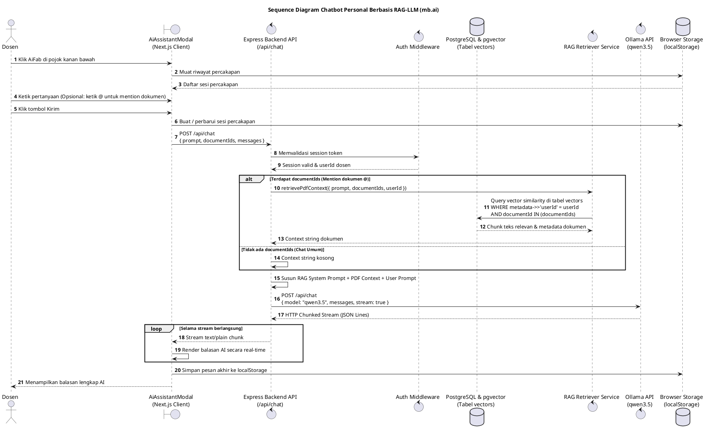

# Sequence Diagram

## Sequence Diagram untuk Chatbot Personal Berbasis RAG-LLM

```plantuml
@startuml
title Sequence Diagram Chatbot Personal Berbasis RAG-LLM (mb.ai)

autonumber
skinparam shadowing false

actor Dosen
boundary "AiAssistantModal\n(Next.js Client)" as UI
control "Express Backend API\n(/api/chat)" as API
control "Auth Middleware" as Auth
database "PostgreSQL & pgvector\n(Tabel vectors)" as DB
control "RAG Retriever Service" as Retriever
control "Ollama API\n(qwen3.5)" as LLM
database "Browser Storage\n(localStorage)" as LocalStorage

Dosen -> UI : Klik AiFab di pojok kanan bawah
UI -> LocalStorage : Muat riwayat percakapan
LocalStorage --> UI : Daftar sesi percakapan

Dosen -> UI : Ketik pertanyaan (Opsional: ketik @ untuk mention dokumen)
Dosen -> UI : Klik tombol Kirim
UI -> LocalStorage : Buat / perbarui sesi percakapan

UI -> API : POST /api/chat\n{ prompt, documentIds, messages }
API -> Auth : Memvalidasi session token
Auth --> API : Session valid & userId dosen

alt Terdapat documentIds (Mention dokumen @)

    API -> Retriever : retrievePdfContext({ prompt, documentIds, userId })
    Retriever -> DB : Query vector similarity di tabel vectors\nWHERE metadata->>'userId' = userId\nAND documentId IN (documentIds)
    DB --> Retriever : Chunk teks relevan & metadata dokumen
    Retriever --> API : Context string dokumen

else Tidak ada documentIds (Chat Umum)

    API -> API : Context string kosong

end

API -> API : Susun RAG System Prompt + PDF Context + User Prompt
API -> LLM : POST /api/chat\n{ model: "qwen3.5", messages, stream: true }

LLM --> API : HTTP Chunked Stream (JSON Lines)

loop Selama stream berlangsung
    API --> UI : Stream text/plain chunk
    UI -> UI : Render balasan AI secara real-time
end

UI -> LocalStorage : Simpan pesan akhir ke localStorage
UI --> Dosen : Menampilkan balasan lengkap AI

@enduml
```
