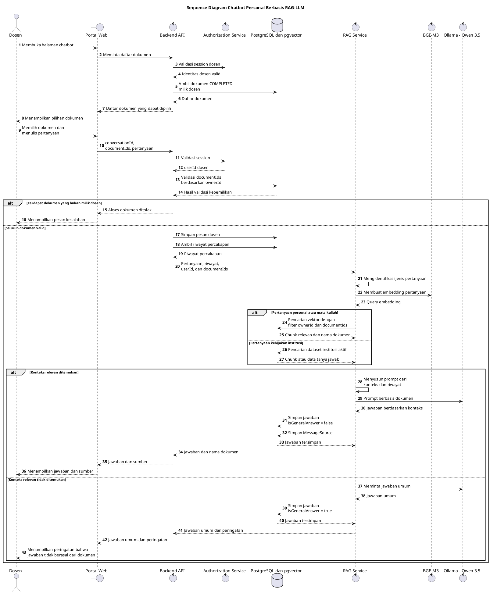

# Sequence Diagram

## Sequence Diagram untuk Chatbot

```plantuml
@startuml
title Sequence Diagram Chatbot Personal Berbasis RAG-LLM

autonumber
skinparam shadowing false

actor Dosen
boundary "Portal Web" as Web
control "Backend API" as API
control "Authorization Service" as Auth
database "PostgreSQL dan pgvector" as DB
control "RAG Service" as RAG
control "BGE-M3" as Embedding
control "Ollama - Qwen 3.5" as LLM

Dosen -> Web : Membuka halaman chatbot
Web -> API : Meminta daftar dokumen
API -> Auth : Validasi session dosen
Auth --> API : Identitas dosen valid
API -> DB : Ambil dokumen COMPLETED\nmilik dosen
DB --> API : Daftar dokumen
API --> Web : Daftar dokumen yang dapat dipilih
Web --> Dosen : Menampilkan pilihan dokumen

Dosen -> Web : Memilih dokumen dan\nmenulis pertanyaan
Web -> API : conversationId,\ndocumentIds, pertanyaan
API -> Auth : Validasi session
Auth --> API : userId dosen

API -> DB : Validasi documentIds\nberdasarkan ownerId
DB --> API : Hasil validasi kepemilikan

alt Terdapat dokumen yang bukan milik dosen

    API --> Web : Akses dokumen ditolak
    Web --> Dosen : Menampilkan pesan kesalahan

else Seluruh dokumen valid

    API -> DB : Simpan pesan dosen
    API -> DB : Ambil riwayat percakapan
    DB --> API : Riwayat percakapan
    API -> RAG : Pertanyaan, riwayat,\nuserId, dan documentIds

    RAG -> RAG : Mengidentifikasi jenis pertanyaan
    RAG -> Embedding : Membuat embedding pertanyaan
    Embedding --> RAG : Query embedding

    alt Pertanyaan personal atau mata kuliah

        RAG -> DB : Pencarian vektor dengan\nfilter ownerId dan documentIds
        DB --> RAG : Chunk relevan dan nama dokumen

    else Pertanyaan kebijakan institusi

        RAG -> DB : Pencarian dataset institusi aktif
        DB --> RAG : Chunk atau data tanya jawab
    end

    alt Konteks relevan ditemukan

        RAG -> RAG : Menyusun prompt dari\nkonteks dan riwayat
        RAG -> LLM : Prompt berbasis dokumen
        LLM --> RAG : Jawaban berdasarkan konteks
        RAG -> DB : Simpan jawaban\nisGeneralAnswer = false
        RAG -> DB : Simpan MessageSource
        DB --> RAG : Jawaban tersimpan
        RAG --> API : Jawaban dan nama dokumen
        API --> Web : Jawaban dan sumber
        Web --> Dosen : Menampilkan jawaban dan sumber

    else Konteks relevan tidak ditemukan

        RAG -> LLM : Meminta jawaban umum
        LLM --> RAG : Jawaban umum
        RAG -> DB : Simpan jawaban\nisGeneralAnswer = true
        DB --> RAG : Jawaban tersimpan
        RAG --> API : Jawaban umum dan peringatan
        API --> Web : Jawaban umum dan peringatan
        Web --> Dosen : Menampilkan peringatan bahwa\njawaban tidak berasal dari dokumen
    end

end

@enduml
```
