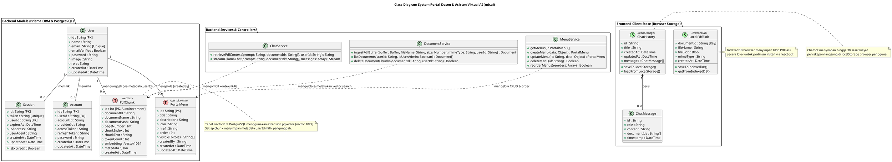

# Class Diagram

```plantuml
@startuml
title Class Diagram System Portal Dosen & Asisten Virtual AI (mb.ai)

package "Backend Models (Prisma ORM & PostgreSQL)" {

    class User {
        +id : String [PK]
        +name : String
        +email : String [Unique]
        +emailVerified : Boolean
        +password : String
        +image : String
        +role : String
        +createdAt : DateTime
        +updatedAt : DateTime
    }

    class Session {
        +id : String [PK]
        +token : String [Unique]
        +userId : String [FK]
        +expiresAt : DateTime
        +ipAddress : String
        +userAgent : String
        +createdAt : DateTime
        +updatedAt : DateTime
        +isExpired() : Boolean
    }

    class Account {
        +id : String [PK]
        +userId : String [FK]
        +accountId : String
        +providerId : String
        +accessToken : String
        +refreshToken : String
        +password : String
        +createdAt : DateTime
        +updatedAt : DateTime
    }

    class PdfChunk << (T,#FFAAAA) vectors >> {
        +id : Int [PK, AutoIncrement]
        +documentId : String
        +documentName : String
        +documentHash : String
        +pageNumber : Int
        +chunkIndex : Int
        +chunkText : String
        +tokenCount : Int
        +embedding : Vector1024
        +metadata : Json
        +createdAt : DateTime
    }

    class PortalMenu << (T,#FFAAAA) portal_menu >> {
        +id : String [PK]
        +title : String
        +description : String
        +icon : String
        +href : String
        +order : Int
        +visibleToRoles : String[]
        +createdBy : String
        +createdAt : DateTime
        +updatedAt : DateTime
    }
}

package "Frontend Client State (Browser Storage)" {

    class ChatHistory << (S,#AAFFAA) localStorage >> {
        +id : String
        +title : String
        +createdAt : DateTime
        +updatedAt : DateTime
        +messages : ChatMessage[]
        +saveToLocalStorage()
        +loadFromLocalStorage()
    }

    class ChatMessage {
        +id : String
        +role : String
        +content : String
        +documentIds : String[]
        +timestamp : DateTime
    }

    class LocalPdfBlob << (S,#AAFFAA) IndexedDB >> {
        +documentId : String [Key]
        +fileName : String
        +fileBlob : Blob
        +mimeType : String
        +createdAt : DateTime
        +saveToIndexedDB()
        +getFromIndexedDB()
    }
}

package "Backend Services & Controllers" {

    class ChatService {
        +retrievePdfContext(prompt: String, documentIds: String[], userId: String) : String
        +streamOllamaChat(prompt: String, documentIds: String[], messages: Array) : Stream
    }

    class DocumentService {
        +ingestPdfBuffer(buffer: Buffer, fileName: String, size: Number, mimeType: String, userId: String) : Document
        +listDocuments(userId: String, isUserAdmin: Boolean) : Document[]
        +deleteDocumentChunks(documentId: String, userId: String) : Boolean
    }

    class MenuService {
        +getMenus() : PortalMenu[]
        +createMenu(data: Object) : PortalMenu
        +updateMenu(id: String, data: Object) : PortalMenu
        +deleteMenu(id: String) : Boolean
        +reorderMenus(reorders: Array) : Boolean
    }
}

User "1" -- "0..n" Session : memilik
User "1" -- "0..n" Account : memiliki
User "1" -- "0..n" PdfChunk : mengunggah (via metadata.userId)
User "1" -- "0..n" PortalMenu : mengelola (createdBy)

ChatHistory "1" *-- "0..n" ChatMessage : berisi

DocumentService ..> PdfChunk : mengelola & melakukan vector search
ChatService ..> PdfChunk : mengambil konteks RAG
MenuService ..> PortalMenu : mengelola CRUD & order

note right of PdfChunk
Tabel 'vectors' di PostgreSQL menggunakan extension pgvector (vector 1024).
Setiap chunk menyimpan metadata userId milik pengunggah.
end note

note right of LocalPdfBlob
IndexedDB browser menyimpan blob PDF asli
secara lokal untuk pratinjau instan via react-pdf.
end note

note right of ChatHistory
Chatbot menyimpan hingga 30 sesi riwayat
percakapan langsung di localStorage browser pengguna.
end note

@enduml
```
