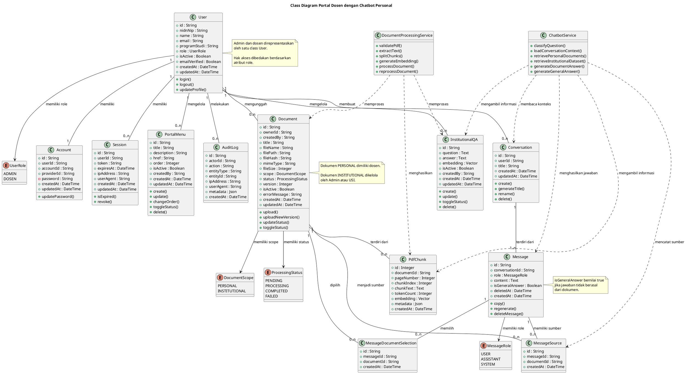

# Class Diagram

```plantuml
@startuml
title Class Diagram Portal Dosen dengan Chatbot Personal

class User {
    +id : String
    +nidnNip : String
    +name : String
    +email : String
    +programStudi : String
    +role : UserRole
    +isActive : Boolean
    +emailVerified : Boolean
    +createdAt : DateTime
    +updatedAt : DateTime

    +login()
    +logout()
    +updateProfile()
}

enum UserRole {
    ADMIN
    DOSEN
}

class Account {
    +id : String
    +userId : String
    +accountId : String
    +providerId : String
    -password : String
    +createdAt : DateTime
    +updatedAt : DateTime

    +updatePassword()
}

class Session {
    +id : String
    +userId : String
    +token : String
    +expiresAt : DateTime
    +ipAddress : String
    +userAgent : String
    +createdAt : DateTime
    +updatedAt : DateTime

    +isExpired()
    +revoke()
}

class PortalMenu {
    +id : String
    +title : String
    +description : String
    +href : String
    +order : Integer
    +isActive : Boolean
    +createdBy : String
    +createdAt : DateTime
    +updatedAt : DateTime

    +create()
    +update()
    +changeOrder()
    +toggleStatus()
    +delete()
}

class Document {
    +id : String
    +ownerId : String
    +createdBy : String
    +title : String
    +fileName : String
    +filePath : String
    +fileHash : String
    +mimeType : String
    +fileSize : Integer
    +scope : DocumentScope
    +status : ProcessingStatus
    +version : Integer
    +isActive : Boolean
    +errorMessage : String
    +createdAt : DateTime
    +updatedAt : DateTime

    +upload()
    +uploadNewVersion()
    +updateStatus()
    +toggleStatus()
}

enum DocumentScope {
    PERSONAL
    INSTITUTIONAL
}

enum ProcessingStatus {
    PENDING
    PROCESSING
    COMPLETED
    FAILED
}

class PdfChunk {
    +id : Integer
    +documentId : String
    +pageNumber : Integer
    +chunkIndex : Integer
    +chunkText : Text
    +tokenCount : Integer
    +embedding : Vector
    +metadata : Json
    +createdAt : DateTime
}

class InstitutionalQA {
    +id : String
    +question : Text
    +answer : Text
    +embedding : Vector
    +isActive : Boolean
    +createdBy : String
    +createdAt : DateTime
    +updatedAt : DateTime

    +create()
    +update()
    +toggleStatus()
    +delete()
}

class Conversation {
    +id : String
    +userId : String
    +title : String
    +createdAt : DateTime
    +updatedAt : DateTime

    +create()
    +generateTitle()
    +rename()
    +delete()
}

class Message {
    +id : String
    +conversationId : String
    +role : MessageRole
    +content : Text
    +isGeneralAnswer : Boolean
    +deletedAt : DateTime
    +createdAt : DateTime

    +copy()
    +regenerate()
    +deleteMessage()
}

enum MessageRole {
    USER
    ASSISTANT
    SYSTEM
}

class MessageDocumentSelection {
    +id : String
    +messageId : String
    +documentId : String
    +createdAt : DateTime
}

class MessageSource {
    +id : String
    +messageId : String
    +documentId : String
    +createdAt : DateTime
}

class AuditLog {
    +id : String
    +actorId : String
    +action : String
    +entityType : String
    +entityId : String
    +ipAddress : String
    +userAgent : String
    +metadata : Json
    +createdAt : DateTime
}

class ChatbotService {
    +classifyQuestion()
    +loadConversationContext()
    +retrievePersonalDocuments()
    +retrieveInstitutionalDataset()
    +generateDocumentAnswer()
    +generateGeneralAnswer()
}

class DocumentProcessingService {
    +validatePdf()
    +extractText()
    +splitChunks()
    +generateEmbedding()
    +processDocument()
    +reprocessDocument()
}

User --> UserRole : memiliki role

User "1" -- "1" Account : memiliki
User "1" -- "0..n" Session : memiliki
User "1" -- "0..n" PortalMenu : mengelola
User "1" -- "0..n" Document : mengunggah
User "1" -- "0..n" InstitutionalQA : mengelola
User "1" -- "0..n" Conversation : membuat
User "1" -- "0..n" AuditLog : melakukan

Document --> DocumentScope : memiliki scope
Document --> ProcessingStatus : memiliki status
Document "1" -- "0..n" PdfChunk : terdiri dari

Conversation "1" -- "1..n" Message : terdiri dari
Message --> MessageRole : memiliki role

Message "1" -- "0..n" MessageDocumentSelection : memilih
Document "1" -- "0..n" MessageDocumentSelection : dipilih

Message "1" -- "0..n" MessageSource : memiliki sumber
Document "1" -- "0..n" MessageSource : menjadi sumber

DocumentProcessingService ..> Document : memproses
DocumentProcessingService ..> PdfChunk : menghasilkan
DocumentProcessingService ..> InstitutionalQA : memproses

ChatbotService ..> Conversation : membaca konteks
ChatbotService ..> Message : menghasilkan jawaban
ChatbotService ..> PdfChunk : mengambil informasi
ChatbotService ..> InstitutionalQA : mengambil informasi
ChatbotService ..> MessageSource : mencatat sumber

note right of User
Admin dan dosen direpresentasikan
oleh satu class User.

Hak akses dibedakan berdasarkan
atribut role.
end note

note right of Document
Dokumen PERSONAL dimiliki dosen.

Dokumen INSTITUTIONAL dikelola
oleh Admin atau USI.
end note

note right of Message
isGeneralAnswer bernilai true
jika jawaban tidak berasal
dari dokumen.
end note

@enduml
```
