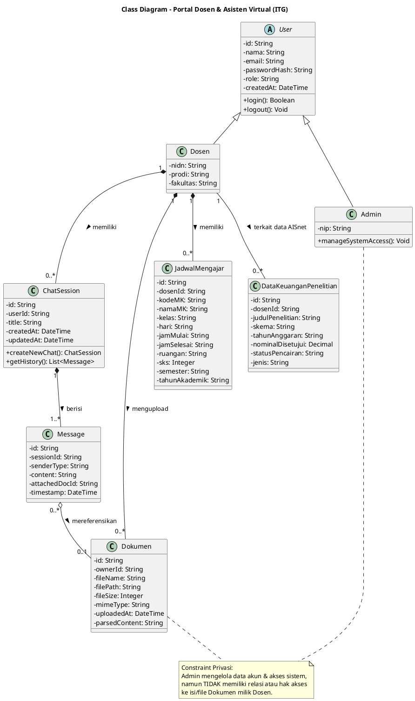

# Class Diagram — Portal Dosen & Asisten Virtual (ITG)

### Penjelasan Diagram
Diagram kelas tunggal ini merepresentasikan struktur model data inti seluruh sistem, hubungan pewarisan `User` ke `Dosen` dan `Admin`, relasi kepemilikan dokumen pribadi dosen, serta batasan privasi data antara Admin dan Dokumen Dosen.

