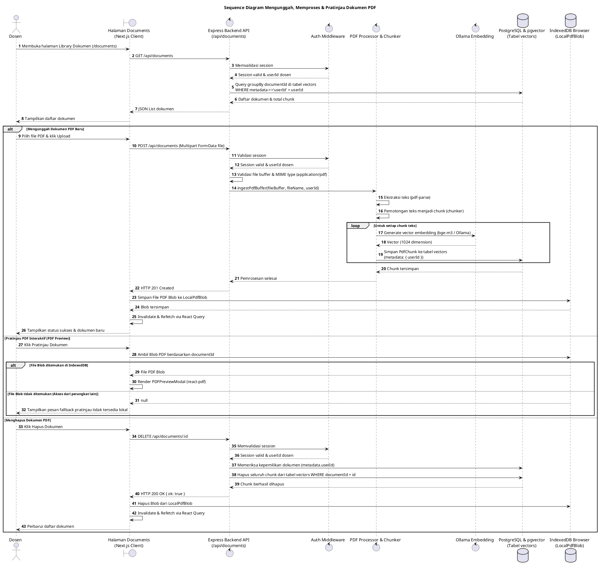

# Sequence Diagram

## Sequence Diagram untuk Mengelola & Memproses Dokumen (Library RAG)

```plantuml
@startuml
title Sequence Diagram Mengunggah, Memproses & Pratinjau Dokumen PDF

autonumber
skinparam shadowing false

actor Dosen
boundary "Halaman Documents\n(Next.js Client)" as UI
control "Express Backend API\n(/api/documents)" as API
control "Auth Middleware" as Auth
control "PDF Processor & Chunker" as Processor
control "Ollama Embedding" as Embedding
database "PostgreSQL & pgvector\n(Tabel vectors)" as DB
database "IndexedDB Browser\n(LocalPdfBlob)" as IndexedDB

Dosen -> UI : Membuka halaman Library Dokumen (/documents)
UI -> API : GET /api/documents
API -> Auth : Memvalidasi session
Auth --> API : Session valid & userId dosen
API -> DB : Query groupBy documentId di tabel vectors\nWHERE metadata->>'userId' = userId
DB --> API : Daftar dokumen & total chunk
API --> UI : JSON List dokumen
UI --> Dosen : Tampilkan daftar dokumen

alt Mengunggah Dokumen PDF Baru

    Dosen -> UI : Pilih file PDF & klik Upload
    UI -> API : POST /api/documents (Multipart FormData file)
    API -> Auth : Validasi session
    Auth --> API : Session valid & userId dosen
    API -> API : Validasi file buffer & MIME type (application/pdf)

    API -> Processor : ingestPdfBuffer(fileBuffer, fileName, userId)
    Processor -> Processor : Ekstraksi teks (pdf-parse)
    Processor -> Processor : Pemotongan teks menjadi chunk (chunker)

    loop Untuk setiap chunk teks
        Processor -> Embedding : Generate vector embedding (bge-m3 / Ollama)
        Embedding --> Processor : Vector (1024 dimension)
        Processor -> DB : Simpan PdfChunk ke tabel vectors\n(metadata: { userId })
    end

    DB --> Processor : Chunk tersimpan
    Processor --> API : Pemrosesan selesai
    API --> UI : HTTP 201 Created

    UI -> IndexedDB : Simpan File PDF Blob ke LocalPdfBlob
    IndexedDB --> UI : Blob tersimpan
    UI -> UI : Invalidate & Refetch via React Query
    UI --> Dosen : Tampilkan status sukses & dokumen baru

else Pratinjau PDF Interaktif (PDF Preview)

    Dosen -> UI : Klik Pratinjau Dokumen
    UI -> IndexedDB : Ambil Blob PDF berdasarkan documentId

    alt File Blob ditemukan di IndexedDB
        IndexedDB --> UI : File PDF Blob
        UI -> UI : Render PDFPreviewModal (react-pdf)
    else File Blob tidak ditemukan (Akses dari perangkat lain)
        IndexedDB --> UI : null
        UI --> Dosen : Tampilkan pesan fallback pratinjau tidak tersedia lokal
    end

else Menghapus Dokumen PDF

    Dosen -> UI : Klik Hapus Dokumen
    UI -> API : DELETE /api/documents/:id
    API -> Auth : Memvalidasi session
    Auth --> API : Session valid & userId dosen
    API -> DB : Memeriksa kepemilikan dokumen (metadata.userId)
    API -> DB : Hapus seluruh chunk dari tabel vectors WHERE documentId = id
    DB --> API : Chunk berhasil dihapus
    API --> UI : HTTP 200 OK { ok: true }
    UI -> IndexedDB : Hapus Blob dari LocalPdfBlob
    UI -> UI : Invalidate & Refetch via React Query
    UI --> Dosen : Perbarui daftar dokumen

end

@enduml
```
