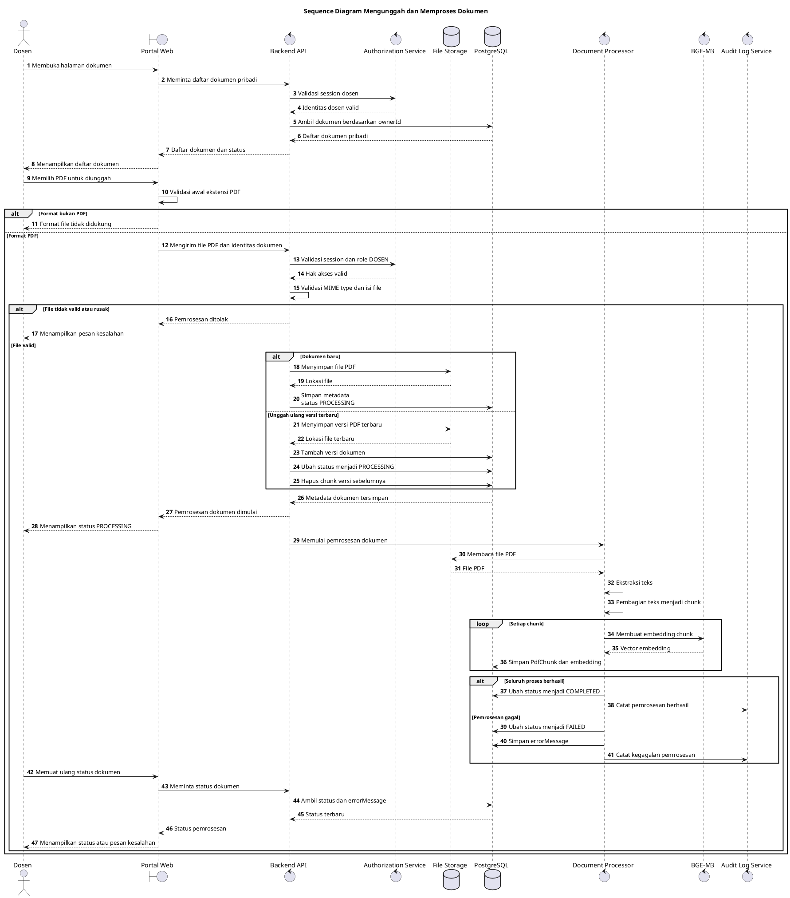

# Sequence Diagram

## Sequence Diagram untuk Mengelola dan Memproses Dokumen

```plantuml
@startuml
title Sequence Diagram Mengunggah dan Memproses Dokumen

autonumber
skinparam shadowing false

actor Dosen
boundary "Portal Web" as Web
control "Backend API" as API
control "Authorization Service" as Auth
database "File Storage" as Storage
database "PostgreSQL" as DB
control "Document Processor" as Processor
control "BGE-M3" as Embedding
control "Audit Log Service" as Log

Dosen -> Web : Membuka halaman dokumen
Web -> API : Meminta daftar dokumen pribadi
API -> Auth : Validasi session dosen
Auth --> API : Identitas dosen valid
API -> DB : Ambil dokumen berdasarkan ownerId
DB --> API : Daftar dokumen pribadi
API --> Web : Daftar dokumen dan status
Web --> Dosen : Menampilkan daftar dokumen

Dosen -> Web : Memilih PDF untuk diunggah
Web -> Web : Validasi awal ekstensi PDF

alt Format bukan PDF

    Web --> Dosen : Format file tidak didukung

else Format PDF

    Web -> API : Mengirim file PDF dan identitas dokumen
    API -> Auth : Validasi session dan role DOSEN
    Auth --> API : Hak akses valid
    API -> API : Validasi MIME type dan isi file

    alt File tidak valid atau rusak

        API --> Web : Pemrosesan ditolak
        Web --> Dosen : Menampilkan pesan kesalahan

    else File valid

        alt Dokumen baru

            API -> Storage : Menyimpan file PDF
            Storage --> API : Lokasi file
            API -> DB : Simpan metadata\nstatus PROCESSING

        else Unggah ulang versi terbaru

            API -> Storage : Menyimpan versi PDF terbaru
            Storage --> API : Lokasi file terbaru
            API -> DB : Tambah versi dokumen
            API -> DB : Ubah status menjadi PROCESSING
            API -> DB : Hapus chunk versi sebelumnya
        end

        DB --> API : Metadata dokumen tersimpan
        API --> Web : Pemrosesan dokumen dimulai
        Web --> Dosen : Menampilkan status PROCESSING

        API -> Processor : Memulai pemrosesan dokumen
        Processor -> Storage : Membaca file PDF
        Storage --> Processor : File PDF
        Processor -> Processor : Ekstraksi teks
        Processor -> Processor : Pembagian teks menjadi chunk

        loop Setiap chunk

            Processor -> Embedding : Membuat embedding chunk
            Embedding --> Processor : Vector embedding
            Processor -> DB : Simpan PdfChunk dan embedding

        end

        alt Seluruh proses berhasil

            Processor -> DB : Ubah status menjadi COMPLETED
            Processor -> Log : Catat pemrosesan berhasil

        else Pemrosesan gagal

            Processor -> DB : Ubah status menjadi FAILED
            Processor -> DB : Simpan errorMessage
            Processor -> Log : Catat kegagalan pemrosesan
        end

        Dosen -> Web : Memuat ulang status dokumen
        Web -> API : Meminta status dokumen
        API -> DB : Ambil status dan errorMessage
        DB --> API : Status terbaru
        API --> Web : Status pemrosesan
        Web --> Dosen : Menampilkan status atau pesan kesalahan
    end

end

@enduml
```
