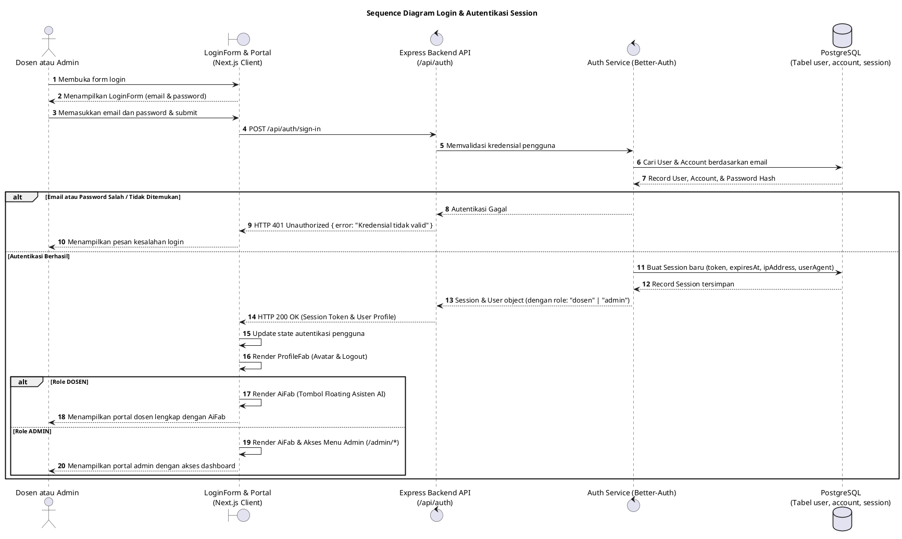

# Sequence Diagram

## Sequence Diagram untuk Login & Autentikasi

```plantuml
@startuml
title Sequence Diagram Login & Autentikasi Session

autonumber
skinparam shadowing false

actor "Dosen atau Admin" as User
boundary "LoginForm & Portal\n(Next.js Client)" as UI
control "Express Backend API\n(/api/auth)" as API
control "Auth Service (Better-Auth)" as Auth
database "PostgreSQL\n(Tabel user, account, session)" as DB

User -> UI : Membuka form login
UI --> User : Menampilkan LoginForm (email & password)

User -> UI : Memasukkan email dan password & submit
UI -> API : POST /api/auth/sign-in
API -> Auth : Memvalidasi kredensial pengguna
Auth -> DB : Cari User & Account berdasarkan email
DB --> Auth : Record User, Account, & Password Hash

alt Email atau Password Salah / Tidak Ditemukan

    Auth --> API : Autentikasi Gagal
    API --> UI : HTTP 401 Unauthorized { error: "Kredensial tidak valid" }
    UI --> User : Menampilkan pesan kesalahan login

else Autentikasi Berhasil

    Auth -> DB : Buat Session baru (token, expiresAt, ipAddress, userAgent)
    DB --> Auth : Record Session tersimpan
    Auth --> API : Session & User object (dengan role: "dosen" | "admin")
    API --> UI : HTTP 200 OK (Session Token & User Profile)

    UI -> UI : Update state autentikasi pengguna
    UI -> UI : Render ProfileFab (Avatar & Logout)

    alt Role DOSEN
        UI -> UI : Render AiFab (Tombol Floating Asisten AI)
        UI --> User : Menampilkan portal dosen lengkap dengan AiFab
    else Role ADMIN
        UI -> UI : Render AiFab & Akses Menu Admin (/admin/*)
        UI --> User : Menampilkan portal admin dengan akses dashboard
    end

end

@enduml
```
