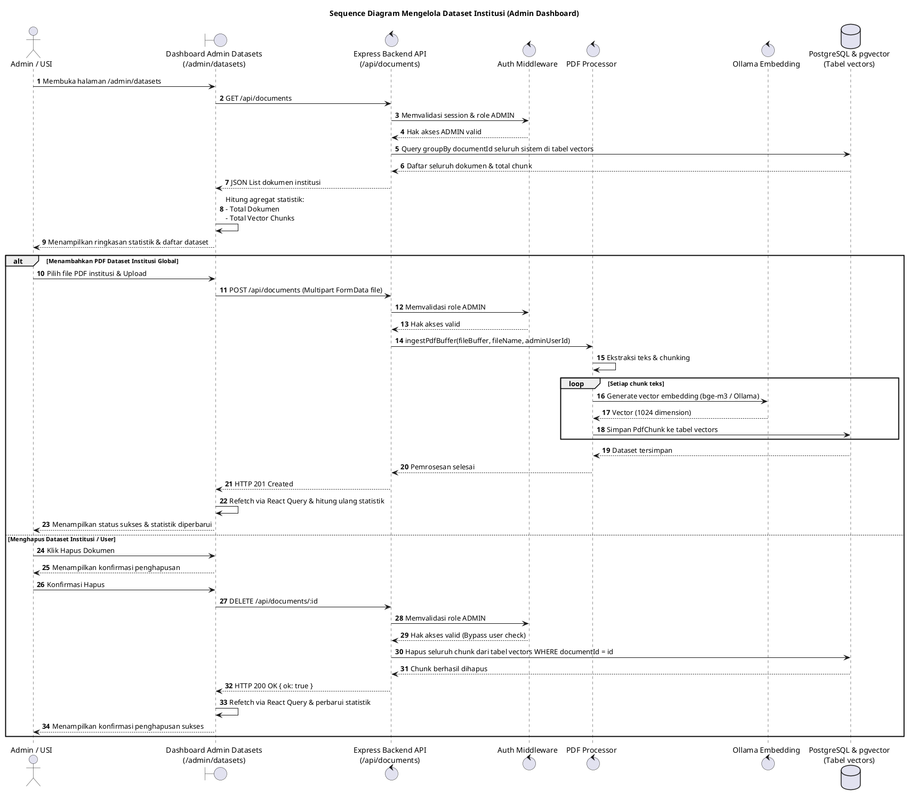

# Sequence Diagram

## Sequence Diagram untuk Mengelola Dataset Institusi (Admin Dashboard `/admin/datasets`)

```plantuml
@startuml
title Sequence Diagram Mengelola Dataset Institusi (Admin Dashboard)

autonumber
skinparam shadowing false

actor "Admin / USI" as Admin
boundary "Dashboard Admin Datasets\n(/admin/datasets)" as UI
control "Express Backend API\n(/api/documents)" as API
control "Auth Middleware" as Auth
control "PDF Processor" as Processor
control "Ollama Embedding" as Embedding
database "PostgreSQL & pgvector\n(Tabel vectors)" as DB

Admin -> UI : Membuka halaman /admin/datasets
UI -> API : GET /api/documents
API -> Auth : Memvalidasi session & role ADMIN
Auth --> API : Hak akses ADMIN valid
API -> DB : Query groupBy documentId seluruh sistem di tabel vectors
DB --> API : Daftar seluruh dokumen & total chunk
API --> UI : JSON List dokumen institusi
UI -> UI : Hitung agregat statistik:\n- Total Dokumen\n- Total Vector Chunks
UI --> Admin : Menampilkan ringkasan statistik & daftar dataset

alt Menambahkan PDF Dataset Institusi Global

    Admin -> UI : Pilih file PDF institusi & Upload
    UI -> API : POST /api/documents (Multipart FormData file)
    API -> Auth : Memvalidasi role ADMIN
    Auth --> API : Hak akses valid

    API -> Processor : ingestPdfBuffer(fileBuffer, fileName, adminUserId)
    Processor -> Processor : Ekstraksi teks & chunking
    loop Setiap chunk teks
        Processor -> Embedding : Generate vector embedding (bge-m3 / Ollama)
        Embedding --> Processor : Vector (1024 dimension)
        Processor -> DB : Simpan PdfChunk ke tabel vectors
    end

    DB --> Processor : Dataset tersimpan
    Processor --> API : Pemrosesan selesai
    API --> UI : HTTP 201 Created
    UI -> UI : Refetch via React Query & hitung ulang statistik
    UI --> Admin : Menampilkan status sukses & statistik diperbarui

else Menghapus Dataset Institusi / User

    Admin -> UI : Klik Hapus Dokumen
    UI --> Admin : Menampilkan konfirmasi penghapusan
    Admin -> UI : Konfirmasi Hapus
    UI -> API : DELETE /api/documents/:id
    API -> Auth : Memvalidasi role ADMIN
    Auth --> API : Hak akses valid (Bypass user check)
    API -> DB : Hapus seluruh chunk dari tabel vectors WHERE documentId = id
    DB --> API : Chunk berhasil dihapus
    API --> UI : HTTP 200 OK { ok: true }
    UI -> UI : Refetch via React Query & perbarui statistik
    UI --> Admin : Menampilkan konfirmasi penghapusan sukses

end

@enduml
```
