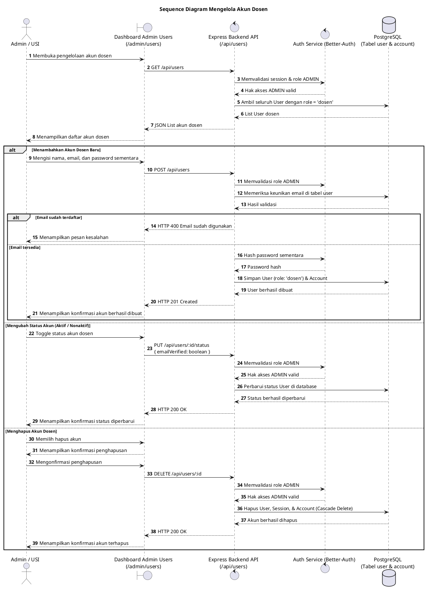

# Sequence Diagram

## Sequence Diagram untuk Mengelola Akun Dosen (`/admin/users`)

```plantuml
@startuml
title Sequence Diagram Mengelola Akun Dosen

autonumber
skinparam shadowing false

actor "Admin / USI" as Admin
boundary "Dashboard Admin Users\n(/admin/users)" as UI
control "Express Backend API\n(/api/users)" as API
control "Auth Service (Better-Auth)" as Auth
database "PostgreSQL\n(Tabel user & account)" as DB

Admin -> UI : Membuka pengelolaan akun dosen
UI -> API : GET /api/users
API -> Auth : Memvalidasi session & role ADMIN
Auth --> API : Hak akses ADMIN valid
API -> DB : Ambil seluruh User dengan role = 'dosen'
DB --> API : List User dosen
API --> UI : JSON List akun dosen
UI --> Admin : Menampilkan daftar akun dosen

alt Menambahkan Akun Dosen Baru

    Admin -> UI : Mengisi nama, email, dan password sementara
    UI -> API : POST /api/users
    API -> Auth : Memvalidasi role ADMIN
    API -> DB : Memeriksa keunikan email di tabel user
    DB --> API : Hasil validasi

    alt Email sudah terdaftar
        API --> UI : HTTP 400 Email sudah digunakan
        UI --> Admin : Menampilkan pesan kesalahan
    else Email tersedia
        API -> Auth : Hash password sementara
        Auth --> API : Password hash
        API -> DB : Simpan User (role: 'dosen') & Account
        DB --> API : User berhasil dibuat
        API --> UI : HTTP 201 Created
        UI --> Admin : Menampilkan konfirmasi akun berhasil dibuat
    end

else Mengubah Status Akun (Aktif / Nonaktif)

    Admin -> UI : Toggle status akun dosen
    UI -> API : PUT /api/users/:id/status\n{ emailVerified: boolean }
    API -> Auth : Memvalidasi role ADMIN
    Auth --> API : Hak akses ADMIN valid
    API -> DB : Perbarui status User di database
    DB --> API : Status berhasil diperbarui
    API --> UI : HTTP 200 OK
    UI --> Admin : Menampilkan konfirmasi status diperbarui

else Menghapus Akun Dosen

    Admin -> UI : Memilih hapus akun
    UI --> Admin : Menampilkan konfirmasi penghapusan
    Admin -> UI : Mengonfirmasi penghapusan
    UI -> API : DELETE /api/users/:id
    API -> Auth : Memvalidasi role ADMIN
    Auth --> API : Hak akses ADMIN valid
    API -> DB : Hapus User, Session, & Account (Cascade Delete)
    DB --> API : Akun berhasil dihapus
    API --> UI : HTTP 200 OK
    UI --> Admin : Menampilkan konfirmasi akun terhapus

end

@enduml
```
