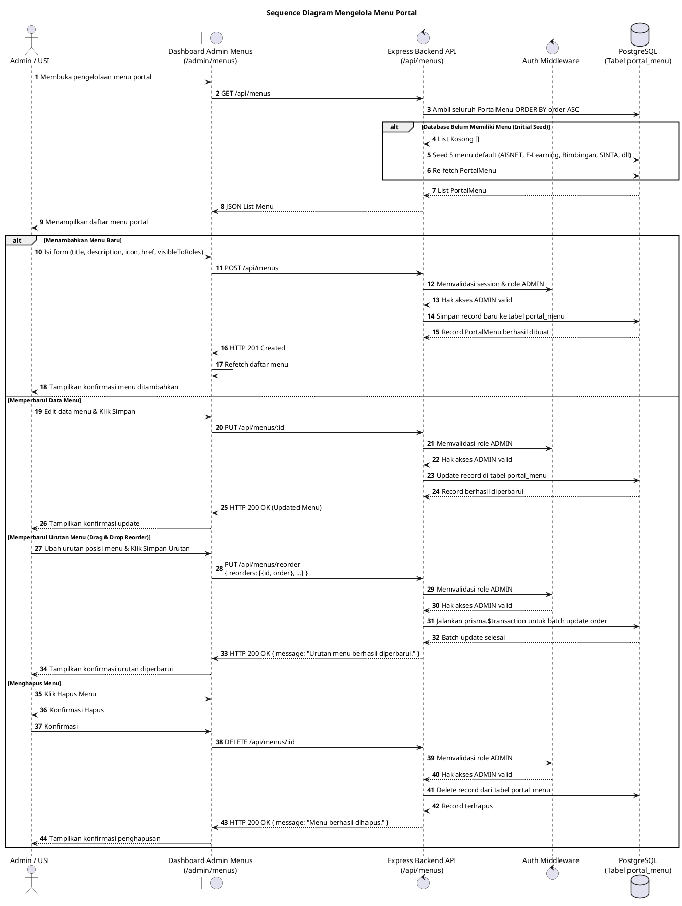

# Sequence Diagram

## Sequence Diagram untuk Mengelola Menu Portal (`/admin/menus`)

```plantuml
@startuml
title Sequence Diagram Mengelola Menu Portal

autonumber
skinparam shadowing false

actor "Admin / USI" as Admin
boundary "Dashboard Admin Menus\n(/admin/menus)" as UI
control "Express Backend API\n(/api/menus)" as API
control "Auth Middleware" as Auth
database "PostgreSQL\n(Tabel portal_menu)" as DB

Admin -> UI : Membuka pengelolaan menu portal
UI -> API : GET /api/menus
API -> DB : Ambil seluruh PortalMenu ORDER BY order ASC

alt Database Belum Memiliki Menu (Initial Seed)
    DB --> API : List Kosong []
    API -> DB : Seed 5 menu default (AISNET, E-Learning, Bimbingan, SINTA, dll)
    API -> DB : Re-fetch PortalMenu
end

DB --> API : List PortalMenu
API --> UI : JSON List Menu
UI --> Admin : Menampilkan daftar menu portal

alt Menambahkan Menu Baru

    Admin -> UI : Isi form (title, description, icon, href, visibleToRoles)
    UI -> API : POST /api/menus
    API -> Auth : Memvalidasi session & role ADMIN
    Auth --> API : Hak akses ADMIN valid
    API -> DB : Simpan record baru ke tabel portal_menu
    DB --> API : Record PortalMenu berhasil dibuat
    API --> UI : HTTP 201 Created
    UI -> UI : Refetch daftar menu
    UI --> Admin : Tampilkan konfirmasi menu ditambahkan

else Memperbarui Data Menu

    Admin -> UI : Edit data menu & Klik Simpan
    UI -> API : PUT /api/menus/:id
    API -> Auth : Memvalidasi role ADMIN
    Auth --> API : Hak akses ADMIN valid
    API -> DB : Update record di tabel portal_menu
    DB --> API : Record berhasil diperbarui
    API --> UI : HTTP 200 OK (Updated Menu)
    UI --> Admin : Tampilkan konfirmasi update

else Memperbarui Urutan Menu (Drag & Drop Reorder)

    Admin -> UI : Ubah urutan posisi menu & Klik Simpan Urutan
    UI -> API : PUT /api/menus/reorder\n{ reorders: [{id, order}, ...] }
    API -> Auth : Memvalidasi role ADMIN
    Auth --> API : Hak akses ADMIN valid
    API -> DB : Jalankan prisma.$transaction untuk batch update order
    DB --> API : Batch update selesai
    API --> UI : HTTP 200 OK { message: "Urutan menu berhasil diperbarui." }
    UI --> Admin : Tampilkan konfirmasi urutan diperbarui

else Menghapus Menu

    Admin -> UI : Klik Hapus Menu
    UI --> Admin : Konfirmasi Hapus
    Admin -> UI : Konfirmasi
    UI -> API : DELETE /api/menus/:id
    API -> Auth : Memvalidasi role ADMIN
    Auth --> API : Hak akses ADMIN valid
    API -> DB : Delete record dari tabel portal_menu
    DB --> API : Record terhapus
    API --> UI : HTTP 200 OK { message: "Menu berhasil dihapus." }
    UI --> Admin : Tampilkan konfirmasi penghapusan

end

@enduml
```
