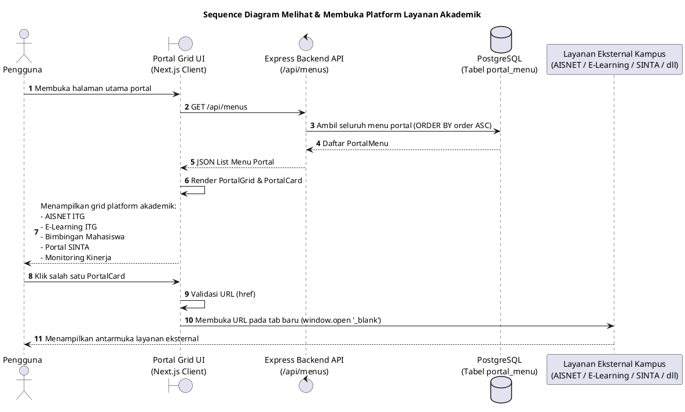

# Sequence Diagram

## Sequence Diagram ketika Membuka Platform Layanan Akademik

```plantuml
@startuml
title Sequence Diagram Melihat & Membuka Platform Layanan Akademik

autonumber
skinparam shadowing false

actor Pengguna
boundary "Portal Grid UI\n(Next.js Client)" as UI
control "Express Backend API\n(/api/menus)" as API
database "PostgreSQL\n(Tabel portal_menu)" as DB
participant "Layanan Eksternal Kampus\n(AISNET / E-Learning / SINTA / dll)" as External

Pengguna -> UI : Membuka halaman utama portal
UI -> API : GET /api/menus
API -> DB : Ambil seluruh menu portal (ORDER BY order ASC)
DB --> API : Daftar PortalMenu
API --> UI : JSON List Menu Portal
UI -> UI : Render PortalGrid & PortalCard

UI --> Pengguna : Menampilkan grid platform akademik:\n- AISNET ITG\n- E-Learning ITG\n- Bimbingan Mahasiswa\n- Portal SINTA\n- Monitoring Kinerja

Pengguna -> UI : Klik salah satu PortalCard
UI -> UI : Validasi URL (href)
UI -> External : Membuka URL pada tab baru (window.open '_blank')
External --> Pengguna : Menampilkan antarmuka layanan eksternal

@enduml
```
