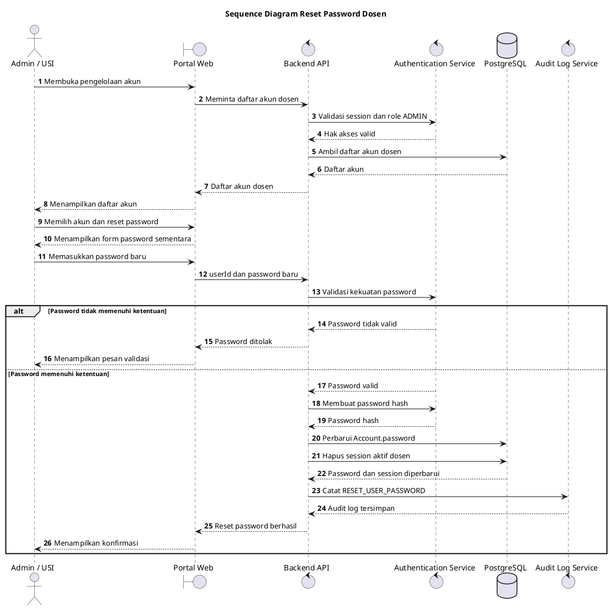

## Sequence Diagram

## Sequence Diagram untuk Reset Password

```plantuml
@startuml
title Sequence Diagram Reset Password Dosen

autonumber
skinparam shadowing false

actor "Admin / USI" as Admin
boundary "Portal Web" as Web
control "Backend API" as API
control "Authentication Service" as Auth
database "PostgreSQL" as DB
control "Audit Log Service" as Log

Admin -> Web : Membuka pengelolaan akun
Web -> API : Meminta daftar akun dosen
API -> Auth : Validasi session dan role ADMIN
Auth --> API : Hak akses valid
API -> DB : Ambil daftar akun dosen
DB --> API : Daftar akun
API --> Web : Daftar akun dosen
Web --> Admin : Menampilkan daftar akun

Admin -> Web : Memilih akun dan reset password
Web --> Admin : Menampilkan form password sementara
Admin -> Web : Memasukkan password baru
Web -> API : userId dan password baru

API -> Auth : Validasi kekuatan password

alt Password tidak memenuhi ketentuan

    Auth --> API : Password tidak valid
    API --> Web : Password ditolak
    Web --> Admin : Menampilkan pesan validasi

else Password memenuhi ketentuan

    Auth --> API : Password valid
    API -> Auth : Membuat password hash
    Auth --> API : Password hash
    API -> DB : Perbarui Account.password
    API -> DB : Hapus session aktif dosen
    DB --> API : Password dan session diperbarui

    API -> Log : Catat RESET_USER_PASSWORD
    Log --> API : Audit log tersimpan
    API --> Web : Reset password berhasil
    Web --> Admin : Menampilkan konfirmasi

end

@enduml
```
