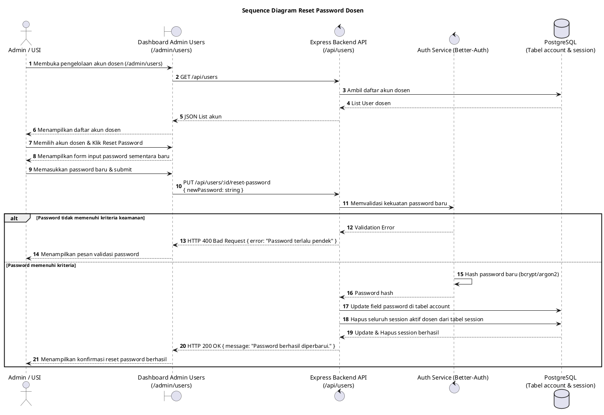

# Sequence Diagram

## Sequence Diagram untuk Reset Password Dosen oleh Admin

```plantuml
@startuml
title Sequence Diagram Reset Password Dosen

autonumber
skinparam shadowing false

actor "Admin / USI" as Admin
boundary "Dashboard Admin Users\n(/admin/users)" as UI
control "Express Backend API\n(/api/users)" as API
control "Auth Service (Better-Auth)" as Auth
database "PostgreSQL\n(Tabel account & session)" as DB

Admin -> UI : Membuka pengelolaan akun dosen (/admin/users)
UI -> API : GET /api/users
API -> DB : Ambil daftar akun dosen
DB --> API : List User dosen
API --> UI : JSON List akun
UI --> Admin : Menampilkan daftar akun dosen

Admin -> UI : Memilih akun dosen & Klik Reset Password
UI --> Admin : Menampilkan form input password sementara baru
Admin -> UI : Memasukkan password baru & submit
UI -> API : PUT /api/users/:id/reset-password\n{ newPassword: string }

API -> Auth : Memvalidasi kekuatan password baru

alt Password tidak memenuhi kriteria keamanan

    Auth --> API : Validation Error
    API --> UI : HTTP 400 Bad Request { error: "Password terlalu pendek" }
    UI --> Admin : Menampilkan pesan validasi password

else Password memenuhi kriteria

    Auth -> Auth : Hash password baru (bcrypt/argon2)
    Auth --> API : Password hash
    API -> DB : Update field password di tabel account
    API -> DB : Hapus seluruh session aktif dosen dari tabel session
    DB --> API : Update & Hapus session berhasil

    API --> UI : HTTP 200 OK { message: "Password berhasil diperbarui." }
    UI --> Admin : Menampilkan konfirmasi reset password berhasil

end

@enduml
```
