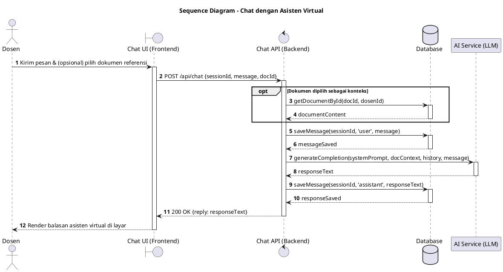
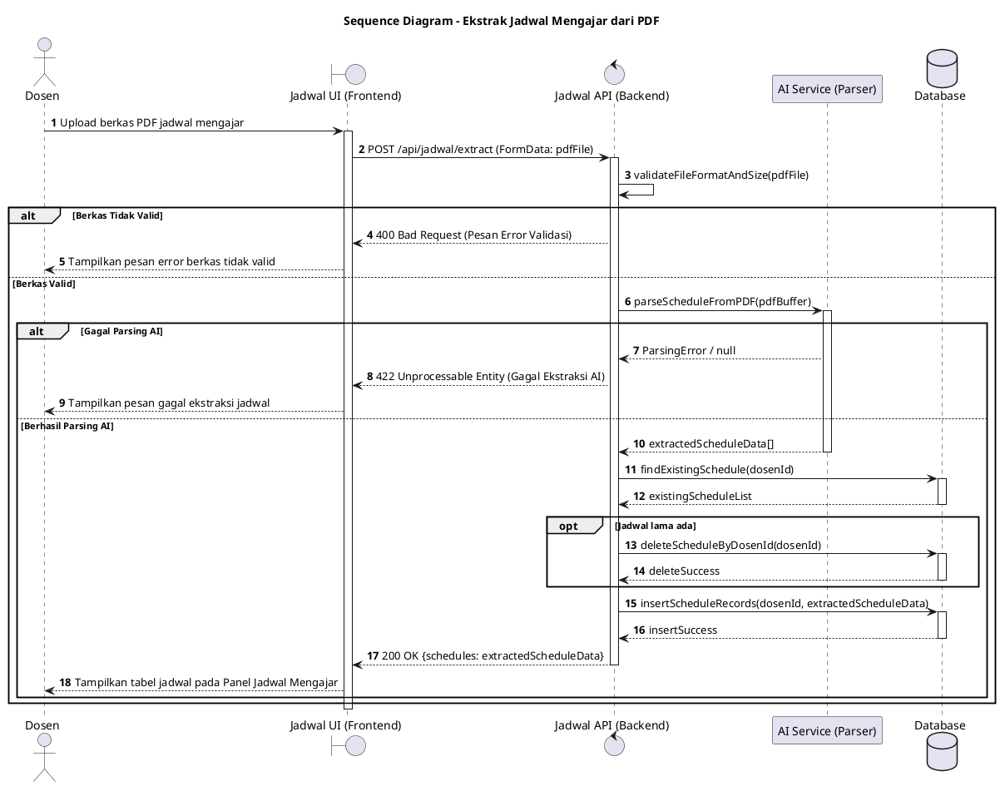
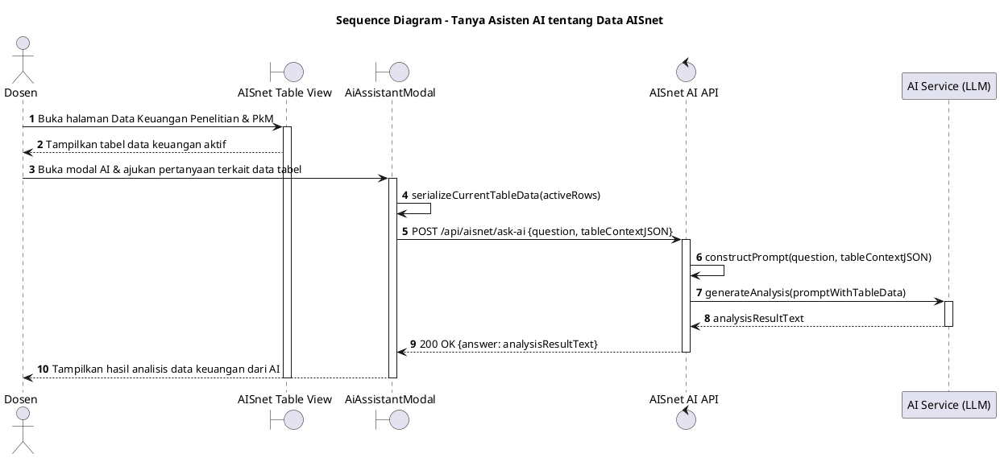

# Sequence Diagram — Portal Dosen & Asisten Virtual (ITG)

Dokumen ini memuat tepat 3 Sequence Diagram untuk use case yang melibatkan interaksi signifikan antar komponen arsitektur backend (**Frontend/UI**, **API/Backend**, **AI Service**, dan **Database**).

---

## 1. Sequence Diagram: Chat dengan Asisten Virtual

### Penjelasan Diagram

Menggambarkan interaksi pengiriman pesan dari antarmuka ke backend, pengambilan dokumen referensi (_opt_) dari database, pemrosesan oleh AI Service, dan penyimpanan riwayat chat ke Database.

---

## 2. Sequence Diagram: Ekstrak Jadwal Mengajar dari PDF

### Penjelasan Diagram

Menggambarkan alur pengunggahan berkas PDF jadwal, ekstraksi struktur jadwal oleh AI Service, pembersihan data jadwal lama, penyimpanan entitas baru ke Database, dan pembaruan tampilan panel Jadwal Mengajar.

---

## 3. Sequence Diagram: Tanya Asisten AI tentang Data AISnet

### Penjelasan Diagram

Menggambarkan alur pengajuan pertanyaan dosen mengenai data tabel keuangan penelitian/PkM yang sedang aktif, di mana data tabel disematkan secara real-time ke AI Service tanpa proses upload berkas.

