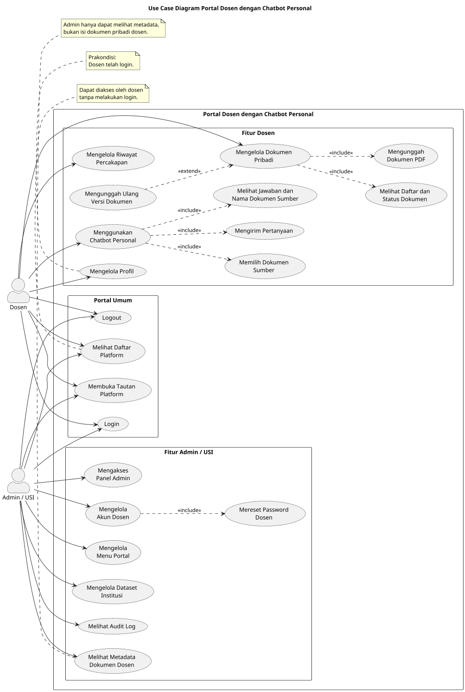

# Use Case Diagram

```plantuml
@startuml
title Use Case Diagram Portal Dosen dengan Chatbot Personal

left to right direction
scale 0.85

skinparam shadowing false
skinparam packageStyle rectangle
skinparam actorStyle awesome

actor Dosen
actor "Admin / USI" as Admin

rectangle "Portal Dosen dengan Chatbot Personal" {

    package "Portal Umum" {
        usecase "Melihat Daftar\nPlatform" as UC01
        usecase "Membuka Tautan\nPlatform" as UC02
        usecase "Login" as UC03
        usecase "Logout" as UC04
    }

    package "Fitur Dosen" {
        usecase "Mengelola Profil" as UC05

        usecase "Mengelola Dokumen\nPribadi" as UC06
        usecase "Melihat Daftar dan\nStatus Dokumen" as UC061
        usecase "Mengunggah\nDokumen PDF" as UC062
        usecase "Mengunggah Ulang\nVersi Dokumen" as UC063

        usecase "Menggunakan\nChatbot Personal" as UC07
        usecase "Memilih Dokumen\nSumber" as UC071
        usecase "Mengirim Pertanyaan" as UC072
        usecase "Melihat Jawaban dan\nNama Dokumen Sumber" as UC073

        usecase "Mengelola Riwayat\nPercakapan" as UC08
    }

    package "Fitur Admin / USI" {
        usecase "Mengakses\nPanel Admin" as UC09
        usecase "Mengelola\nAkun Dosen" as UC10
        usecase "Mereset Password\nDosen" as UC101
        usecase "Mengelola\nMenu Portal" as UC11
        usecase "Mengelola Dataset\nInstitusi" as UC12
        usecase "Melihat Metadata\nDokumen Dosen" as UC13
        usecase "Melihat Audit Log" as UC14
    }
}

Dosen --> UC01
Dosen --> UC02
Dosen --> UC03
Dosen --> UC04
Dosen --> UC05
Dosen --> UC06
Dosen --> UC07
Dosen --> UC08

Admin --> UC01
Admin --> UC02
Admin --> UC03
Admin --> UC04
Admin --> UC09
Admin --> UC10
Admin --> UC11
Admin --> UC12
Admin --> UC13
Admin --> UC14

UC06 ..> UC061 : <<include>>
UC06 ..> UC062 : <<include>>
UC063 ..> UC06 : <<extend>>

UC07 ..> UC071 : <<include>>
UC07 ..> UC072 : <<include>>
UC07 ..> UC073 : <<include>>

UC10 ..> UC101 : <<include>>

note bottom of UC01
Dapat diakses oleh dosen
tanpa melakukan login.
end note

note bottom of UC05
Prakondisi:
Dosen telah login.
end note

note bottom of UC13
Admin hanya dapat melihat metadata,
bukan isi dokumen pribadi dosen.
end note

@enduml
```
