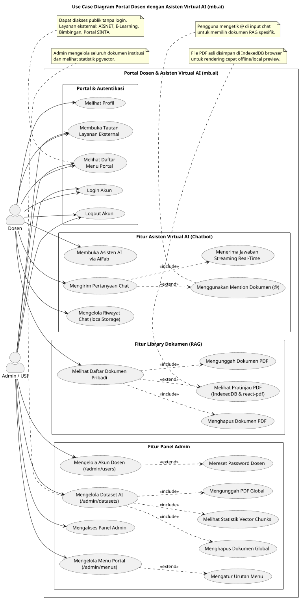

# Use Case Diagram

```plantuml
@startuml
title Use Case Diagram Portal Dosen dengan Asisten Virtual AI (mb.ai)

left to right direction
scale 0.85

skinparam shadowing false
skinparam packageStyle rectangle
skinparam actorStyle awesome

actor Dosen
actor "Admin / USI" as Admin

rectangle "Portal Dosen & Asisten Virtual AI (mb.ai)" {

    package "Portal & Autentikasi" {
        usecase "Melihat Daftar\nMenu Portal" as UC01
        usecase "Membuka Tautan\nLayanan Eksternal" as UC02
        usecase "Login Akun" as UC03
        usecase "Logout Akun" as UC04
        usecase "Melihat Profil" as UC05
    }

    package "Fitur Asisten Virtual AI (Chatbot)" {
        usecase "Membuka Asisten AI\nvia AiFab" as UC06
        usecase "Mengirim Pertanyaan Chat" as UC07
        usecase "Menggunakan Mention Dokumen (@)" as UC071
        usecase "Menerima Jawaban\nStreaming Real-Time" as UC072
        usecase "Mengelola Riwayat\nChat (localStorage)" as UC08
    }

    package "Fitur Library Dokumen (RAG)" {
        usecase "Melihat Daftar Dokumen\nPribadi" as UC09
        usecase "Mengunggah Dokumen PDF" as UC091
        usecase "Menghapus Dokumen PDF" as UC092
        usecase "Melihat Pratinjau PDF\n(IndexedDB & react-pdf)" as UC093
    }

    package "Fitur Panel Admin" {
        usecase "Mengakses Panel Admin" as UC10
        usecase "Mengelola Dataset AI\n(/admin/datasets)" as UC11
        usecase "Melihat Statistik Vector Chunks" as UC111
        usecase "Mengunggah PDF Global" as UC112
        usecase "Menghapus Dokumen Global" as UC113
        usecase "Mengelola Menu Portal\n(/admin/menus)" as UC12
        usecase "Mengatur Urutan Menu" as UC121
        usecase "Mengelola Akun Dosen\n(/admin/users)" as UC13
        usecase "Mereset Password Dosen" as UC131
    }
}

Dosen --> UC01
Dosen --> UC02
Dosen --> UC03
Dosen --> UC04
Dosen --> UC05
Dosen --> UC06
Dosen --> UC07
Dosen --> UC08
Dosen --> UC09

Admin --> UC01
Admin --> UC02
Admin --> UC03
Admin --> UC04
Admin --> UC10
Admin --> UC11
Admin --> UC12
Admin --> UC13

UC07 ..> UC071 : <<extend>>
UC07 ..> UC072 : <<include>>

UC09 ..> UC091 : <<include>>
UC09 ..> UC092 : <<include>>
UC09 ..> UC093 : <<extend>>

UC11 ..> UC111 : <<include>>
UC11 ..> UC112 : <<include>>
UC11 ..> UC113 : <<include>>

UC12 ..> UC121 : <<extend>>
UC13 ..> UC131 : <<extend>>

note bottom of UC01
Dapat diakses publik tanpa login.
Layanan eksternal: AISNET, E-Learning,
Bimbingan, Portal SINTA.
end note

note bottom of UC071
Pengguna mengetik @ di input chat
untuk memilih dokumen RAG spesifik.
end note

note bottom of UC093
File PDF asli disimpan di IndexedDB browser
untuk rendering cepat offline/local preview.
end note

note bottom of UC11
Admin mengelola seluruh dokumen institusi
dan melihat statistik pgvector.
end note

@enduml
```
