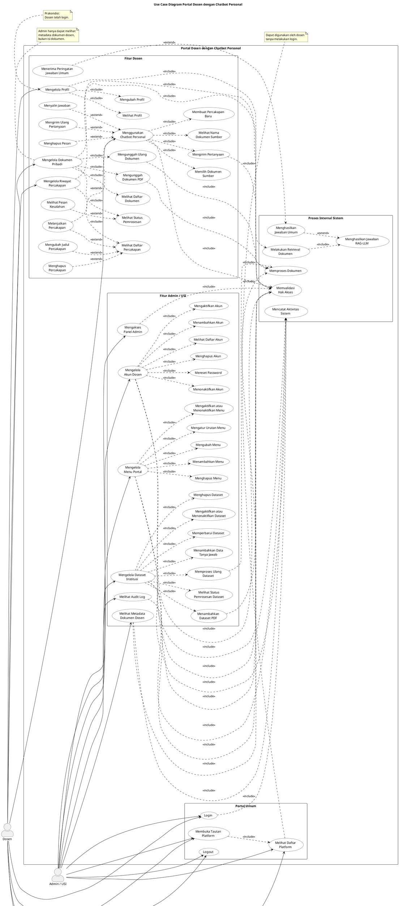

```plantuml
@startuml
title Use Case Diagram Portal Dosen dengan Chatbot Personal

left to right direction
skinparam packageStyle rectangle
skinparam shadowing false
skinparam actorStyle awesome
skinparam usecase {
BackgroundColor White
BorderColor Black
ArrowColor Black
}

actor Dosen
actor "Admin / USI" as Admin

rectangle "Portal Dosen dengan Chatbot Personal" {

    package "Portal Umum" {
        usecase "Melihat Daftar\nPlatform" as UC01
        usecase "Membuka Tautan\nPlatform" as UC02
        usecase "Login" as UC03
        usecase "Logout" as UC04
    }

    package "Fitur Dosen" {
        usecase "Mengelola Profil" as UC05
        usecase "Melihat Profil" as UC051
        usecase "Mengubah Profil" as UC052

        usecase "Mengelola Dokumen\nPribadi" as UC06
        usecase "Melihat Daftar\nDokumen" as UC061
        usecase "Mengunggah\nDokumen PDF" as UC062
        usecase "Mengunggah Ulang\nDokumen" as UC063
        usecase "Melihat Status\nPemrosesan" as UC064
        usecase "Melihat Pesan\nKesalahan" as UC065

        usecase "Menggunakan\nChatbot Personal" as UC07
        usecase "Membuat Percakapan\nBaru" as UC071
        usecase "Memilih Dokumen\nSumber" as UC072
        usecase "Mengirim Pertanyaan" as UC073
        usecase "Melanjutkan\nPercakapan" as UC074
        usecase "Melihat Nama\nDokumen Sumber" as UC075
        usecase "Menyalin Jawaban" as UC076
        usecase "Mengirim Ulang\nPertanyaan" as UC077
        usecase "Menghapus Pesan" as UC078
        usecase "Menerima Peringatan\nJawaban Umum" as UC079

        usecase "Mengelola Riwayat\nPercakapan" as UC08
        usecase "Melihat Daftar\nPercakapan" as UC081
        usecase "Mengubah Judul\nPercakapan" as UC082
        usecase "Menghapus\nPercakapan" as UC083
    }

    package "Fitur Admin / USI" {
        usecase "Mengakses\nPanel Admin" as UC09

        usecase "Mengelola\nAkun Dosen" as UC10
        usecase "Melihat Daftar Akun" as UC101
        usecase "Menambahkan Akun" as UC102
        usecase "Mengaktifkan Akun" as UC103
        usecase "Menonaktifkan Akun" as UC104
        usecase "Mereset Password" as UC105
        usecase "Menghapus Akun" as UC106

        usecase "Mengelola\nMenu Portal" as UC11
        usecase "Menambahkan Menu" as UC111
        usecase "Mengubah Menu" as UC112
        usecase "Mengatur Urutan Menu" as UC113
        usecase "Mengaktifkan atau\nMenonaktifkan Menu" as UC114
        usecase "Menghapus Menu" as UC115

        usecase "Mengelola Dataset\nInstitusi" as UC12
        usecase "Menambahkan\nDataset PDF" as UC121
        usecase "Menambahkan Data\nTanya Jawab" as UC122
        usecase "Memperbarui Dataset" as UC123
        usecase "Mengaktifkan atau\nMenonaktifkan Dataset" as UC124
        usecase "Menghapus Dataset" as UC125
        usecase "Memproses Ulang\nDataset" as UC126
        usecase "Melihat Status\nPemrosesan Dataset" as UC127

        usecase "Melihat Metadata\nDokumen Dosen" as UC13
        usecase "Melihat Audit Log" as UC14
    }

    package "Proses Internal Sistem" {
        usecase "Mencatat Aktivitas\nSistem" as UC15
        usecase "Memvalidasi\nHak Akses" as UC16
        usecase "Memproses Dokumen" as UC17
        usecase "Melakukan Retrieval\nDokumen" as UC18
        usecase "Menghasilkan Jawaban\nRAG-LLM" as UC19
        usecase "Menghasilkan\nJawaban Umum" as UC20
    }

}

Dosen --> UC01
Dosen --> UC02
Dosen --> UC03
Dosen --> UC04
Dosen --> UC05
Dosen --> UC06
Dosen --> UC07
Dosen --> UC08

Admin --> UC01
Admin --> UC02
Admin --> UC03
Admin --> UC04
Admin --> UC09
Admin --> UC10
Admin --> UC11
Admin --> UC12
Admin --> UC13
Admin --> UC14

UC02 ..> UC01 : <<include>>

UC05 ..> UC051 : <<include>>
UC05 ..> UC052 : <<include>>
UC05 ..> UC16 : <<include>>

UC06 ..> UC061 : <<include>>
UC06 ..> UC062 : <<include>>
UC06 ..> UC063 : <<include>>
UC06 ..> UC064 : <<include>>
UC06 ..> UC16 : <<include>>

UC062 ..> UC17 : <<include>>
UC063 ..> UC17 : <<include>>
UC065 ..> UC064 : <<extend>>

UC07 ..> UC071 : <<include>>
UC07 ..> UC072 : <<include>>
UC07 ..> UC073 : <<include>>
UC07 ..> UC075 : <<include>>
UC07 ..> UC16 : <<include>>

UC074 ..> UC07 : <<extend>>
UC076 ..> UC07 : <<extend>>
UC077 ..> UC07 : <<extend>>
UC078 ..> UC07 : <<extend>>

UC073 ..> UC18 : <<include>>
UC18 ..> UC19 : <<include>>
UC20 ..> UC19 : <<extend>>
UC079 ..> UC20 : <<extend>>

UC08 ..> UC081 : <<include>>
UC08 ..> UC16 : <<include>>
UC082 ..> UC081 : <<extend>>
UC083 ..> UC081 : <<extend>>
UC074 ..> UC081 : <<extend>>

UC09 ..> UC16 : <<include>>

UC10 ..> UC101 : <<include>>
UC10 ..> UC102 : <<include>>
UC10 ..> UC103 : <<include>>
UC10 ..> UC104 : <<include>>
UC10 ..> UC105 : <<include>>
UC10 ..> UC106 : <<include>>
UC10 ..> UC15 : <<include>>
UC10 ..> UC16 : <<include>>

UC11 ..> UC111 : <<include>>
UC11 ..> UC112 : <<include>>
UC11 ..> UC113 : <<include>>
UC11 ..> UC114 : <<include>>
UC11 ..> UC115 : <<include>>
UC11 ..> UC15 : <<include>>
UC11 ..> UC16 : <<include>>

UC12 ..> UC121 : <<include>>
UC12 ..> UC122 : <<include>>
UC12 ..> UC123 : <<include>>
UC12 ..> UC124 : <<include>>
UC12 ..> UC125 : <<include>>
UC12 ..> UC126 : <<include>>
UC12 ..> UC127 : <<include>>
UC12 ..> UC15 : <<include>>
UC12 ..> UC16 : <<include>>

UC121 ..> UC17 : <<include>>
UC126 ..> UC17 : <<include>>

UC13 ..> UC16 : <<include>>
UC13 ..> UC15 : <<include>>
UC14 ..> UC16 : <<include>>

UC03 ..> UC15 : <<include>>

note bottom of UC01
Dapat digunakan oleh dosen
tanpa melakukan login.
end note

note bottom of UC05
Prakondisi:
Dosen telah login.
end note

note bottom of UC06
Admin hanya dapat melihat
metadata dokumen dosen,
bukan isi dokumen.
end note

@enduml
```
