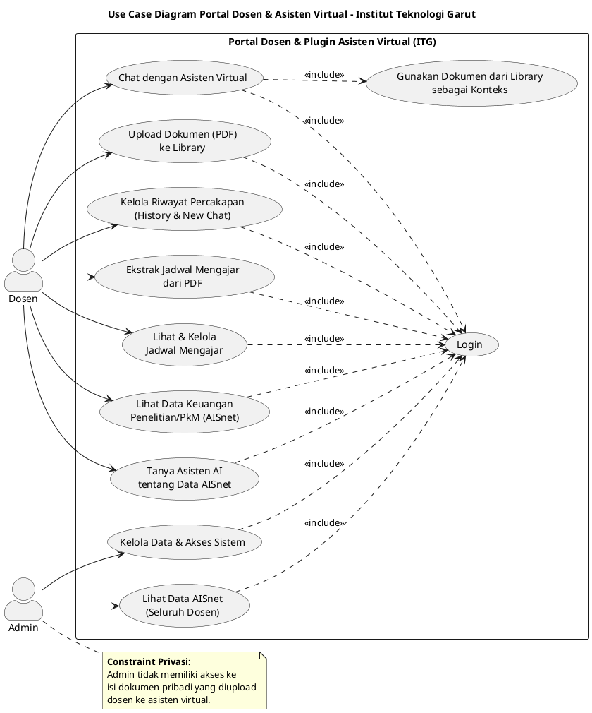

# Use Case Diagram — Portal Dosen & Asisten Virtual (ITG)

### Penjelasan Diagram
Diagram Use Case ini memodelkan seluruh interaksi fungsional utama antara sistem dengan dua aktor utama, yaitu **Dosen** dan **Admin**. Seluruh use case yang membutuhkan autentikasi memiliki relasi `<<include>>` ke use case *Login*, dengan catatan batasan privasi bahwa Admin tidak memiliki hak akses terhadap isi dokumen pribadi milik Dosen.

